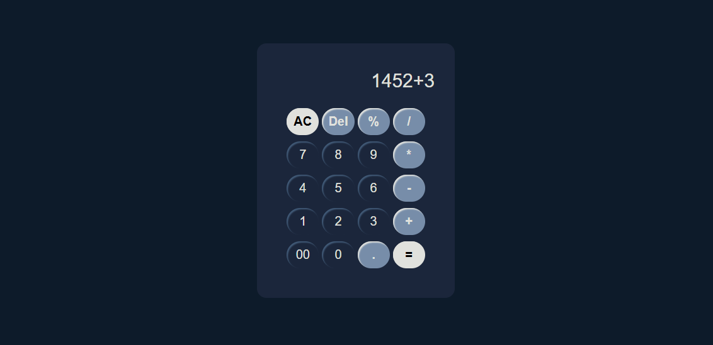

# ✨ Simple Calculator

---

## Overview 💻



This is a clean, modern, and easy-to-use **Simple Calculator** application. Designed with a focus on **aesthetics** and **functionality**, it provides all the essential arithmetic operations you need in a sleek, dark-themed interface. It's an excellent example project for demonstrating basic front-end development skills and creating an intuitive user experience.

---

## Features 🌟

* **Standard Arithmetic Operations:** Perform addition ($+$), subtraction ($-$), multiplication ($\times$), and division ($\div$).
* **Percentage Functionality:** Easily calculate percentages ($\%$).
* **Clear and Delete:** Includes **"AC"** (All Clear) and **"Del"** (Delete last entry) buttons for quick error correction.
* **Modern UI/UX:** Features a minimalist, **dark-mode** design with soft, rounded buttons, following a **Soft UI** or **Neumorphism** style.
* **Responsive Design:** Works well across various screen sizes and devices.

---

## Technologies Used 🛠️

This project was built using a standard web development stack:

* **HTML:** For the basic structure and layout.
* **CSS / SCSS:** For styling, including the dark theme and the unique button effects.
* **JavaScript (ES6+):** For all the core calculator logic and interactivity.

---

## Getting Started 🚀

To run this project locally, follow these simple steps:

1.  **Clone the repository:**
    ```bash
    git clone https://github.com/Velang2003/simple-calculator.git
    ```
2.  **Navigate to the project directory:**
    ```bash
    cd simple-calculator
    ```
3.  **Open the file:**
    Simply open the `index.html` file in your preferred web browser.

---

## Contribution 🤝

Contributions, issues, and feature requests are welcome! Feel free to check the [issues page] if you want to contribute or suggest new features.

---

## License 📝

This project is MIT licensed.
